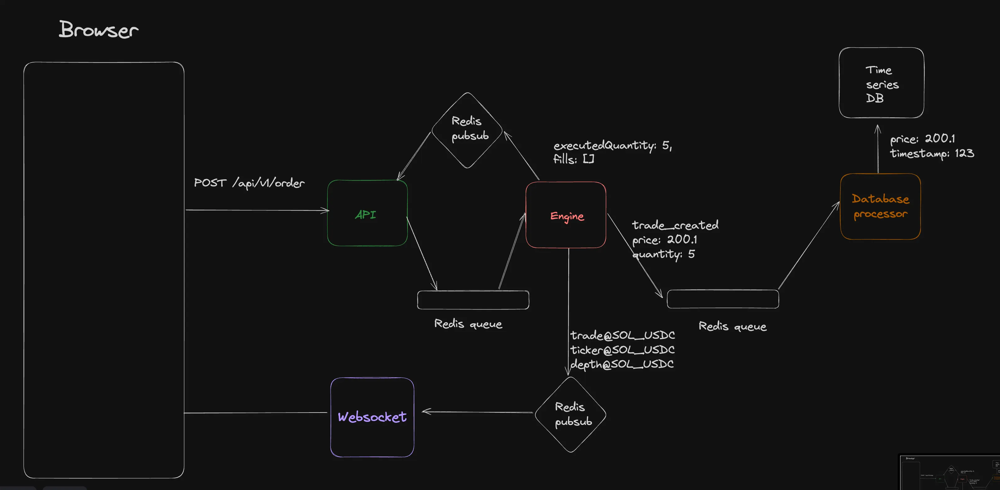

# Swapify Exchange Application

Swapify is a robust exchange application that allows users to track the current share prices of various markets, such as Solana (SOL) and Bitcoin (BTC).It features real-time updates, order book management, and direct backend integration for fetching and managing exchange data.

---

## ⚙️ Tech Stack

### Frontend
- **Next.js** – For building a dynamic and interactive UI.
- **Tailwind CSS** – For responsive and efficient styling.

### Backend
- **Express.js** – For backend server logic and API endpoints.
- **WebSocket** – For real-time updates on order book, Klines, and trades.
- **Redis** – For pub/sub and queue mechanisms to manage order flows and data streams.
- **Time Series DB** – To store and query trade and price data.
- **Proxy Server** – A temporary Node.js server (deployed on **AWS EC2**) used **only when backend is not run locally**, to bypass CORS and fetch data from external exchanges.

**Note:** The proxy server is used only when the full backend is not being run. The custom backend eliminates the need to rely on any third-party proxy or external exchange directly.

---

## 🖼️ Backend Architecture

The image below shows the backend architecture for Swapify:




---

## 🖥️ Running the Application

### ✅ Option 1: Using Proxy Server (Quick Start – No Backend)

If you want to quickly test the frontend without running the backend:

1. Clone and run the proxy server:
   ```sh
   git clone https://github.com/SamarthRajput/exchange-proxy-server
   cd exchange-proxy-server
   npm install
   node index.js
   ```

2. Navigate to the frontend and start the server:
   ```sh
   cd ../exchange-frontend
   npm install
   npm run dev
   ```

---

### ✅ Option 2: Running Full Backend (No Need for Proxy Server)

To avoid using a proxy and enable full backend capabilities:

1. **Start Redis & Time Series DB using Docker**  
   ```sh
   cd backend/docker
   docker compose up
   ```

2. **Start API Server**  
   ```sh
   cd backend/api
   npm install
   npm run dev
   ```

3. **Start Matching Engine**  
   ```sh
   cd backend/engine
   npm run dev
   ```

4. **Start WebSocket Server**  
   ```sh
   cd backend/ws
   npm run dev
   ```

5. **Start Market Maker (for order book population)**  
   ```sh
   cd backend/mm
   npm run dev
   ```

   > This will populate the order book. Restart this step if you need to repopulate the order book.

6. **Start Frontend**  
   ```sh
   cd exchange-frontend
   npm install
   npm run dev
   ```

---

## 🤝 Contribution

Feel free to fork this repository and submit pull requests to improve the project. Contributions are welcome!
